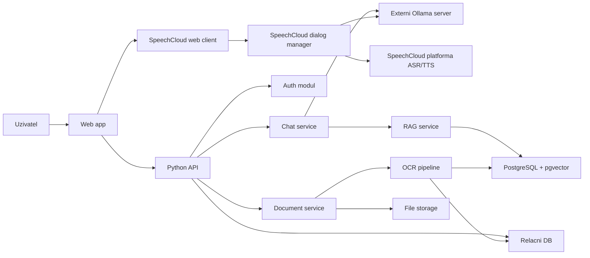

# Architektura

## Cílový obraz

System bude rozdeleny na webovy frontend, Python backend, dialogovy SpeechCloud manager, databazi, externi LLM runtime pres Ollama a pozdeji take dokumentovou OCR/RAG pipeline. Aplikacni casti projektu budou spoustene pres Docker Compose v samostatnych kontejnerech, s vyjimkou externi SpeechCloud platformy a externiho Ollama serveru.

## První MVP: text + SpeechCloud chat

V prvni fazi bude aktivni pouze cast:

- Web app
- Python API
- SpeechCloud dialog manager
- Auth modul
- Chat service
- Ollama client
- Relacni databaze pro uzivatele a historii chatu

Dokumentova pipeline, OCR a RAG budou navrzene jako budouci rozsireni. V aktualni fazi se neprebira pouze ukazkova implementace RAG ze slozky `example`.

## Backend moduly

- `auth`: registrace, prihlaseni, hash hesel, session nebo JWT.
- `users`: sprava uzivatelske identity a uzivatelskych nastaveni.
- `chat`: konverzace, zpravy, streamovani odpovedi, systemove prompty.
- `llm`: adapter pro Ollama API, vyber modelu, timeouty, chyby.
- `speechcloud`: dialog manager, ASR/TTS flow, WebSocket komunikace se SpeechCloud.
- `documents`: budouci upload, metadata, stav zpracovani.
- `ocr`: budouci extrakce textu z dokumentu.
- `rag`: budouci chunking, embeddings, vyhledavani relevantniho kontextu.

## Datový model pro MVP

Minimalni entity:

- `User`: id, email, password_hash, created_at, is_active.
- `Conversation`: id, user_id, title, created_at, updated_at.
- `Message`: id, conversation_id, role, content, model, created_at.

Pozdejsi entity:

- `Document`: id, user_id, filename, mime_type, storage_path, status, created_at.
- `DocumentFile`: id, document_id, user_id, filename, mime_type, storage_path, sort_order, created_at.
- `OcrResult`: id, document_id, raw_text, normalized_text, rag_text, metadata_json, language, page_count, engine, created_at.
- `DocumentExtraction`: id, document_id, structured_json, summary, review_status, model, raw_response, created_at.
- `DocumentSummary`: pozdeji pripadna schvalena/provozni verze popisku, pokud se oddeli od extrakce.
- `UserSettings`: id, user_id, ocr_processing_model; pozdeji chat_model, extraction_model, embedding_model.
- `DocumentChunk`: id, document_id, text, embedding_ref, metadata.
- `ExtractedField`: id, document_id, field_name, field_value, confidence.

## Chat flow

1. Frontend odesle zpravu na backend.
2. Backend overi uzivatele.
3. Backend ulozi uzivatelskou zpravu.
4. Backend sestavi kontext konverzace.
5. Backend zavola Ollama server.
6. Backend streamuje nebo vrati odpoved.
7. Backend ulozi odpoved asistenta.

## Budoucí RAG flow

1. Uzivatel nahraje dokument.
2. Backend ulozi jeden nebo vice souboru/fotek do slozky dokladu.
3. OCR pipeline vytahne text ze vsech souboru dokladu ve spravnem poradi. Vychozi engine muze volat externi Ollama model `glm-ocr:latest`; EasyOCR/Tesseract zustavaji fallback.
4. LLM post-processing ve vychozim rezimu `vision_hybrid` posle do modelu OCR text i obrazky dokladu a vytvori strukturovana pole a lidsky popisek dokladu.
5. Uzivatel zkontroluje a schvali/upravi popisek a dulezita pole.
6. Prvni verze indexuje jeden deterministicky slozeny `rag_text`: popisek, klicova strukturovana pole a polozky. Raw OCR se neembeduje cely; zustava ulozeny pro audit a kontrolu.
7. Pri dotazu chat service vyzada relevantni dokumenty/chunky z RAG service.
8. Model dostane dotaz, historii a dokumentovy kontext vcetne odkazu na zdroj.
9. Odpoved obsahuje odkazy na detail celeho dokladu a pripadne pasaze.

## Aktualni RAG flow

- `DocumentExtraction.summary` a vybrana pole z JSONu se skladaji do `OcrResult.rag_text`.
- Po uspesnem strukturovani backend vytvori embedding pres Ollama model `RAG_EMBEDDING_MODEL`.
- Embedding se ulozi do `document_chunks` v PostgreSQL/pgvector, zatim jako jeden chunk na doklad.
- Pri chat dotazu backend udela semanticke hledani nad `document_chunks` pouze pro aktualni `user_id`.
- Nalezene doklady se vlozi do systemoveho kontextu pred volanim chat modelu.
- Pokud tabulka nebo embedding model nejsou dostupne, chat zustava funkcni bez RAG kontextu.

## LLM zpracovani dokladu

OCR vystup neni finalni datovy produkt. Uklada se jako auditovatelny raw/normalizovany text. Nad nim bezi samostatny LLM krok pres Ollama. Vychozi rezim je hybridni: model dostane OCR text jako datovou kotvu a obrazek/fotky dokladu jako vizualni kotvu pro layout, tabulky a role poli. Tento krok few-shot promptem vytvori:

- strukturovana pole dokladu,
- kratky lidsky popisek vhodny pro embedding,
- confidence/nejistoty a pripadne odkazy na evidence v OCR textu.

U faktur schema rozlisuje adresy podle role: sidlo dodavatele, provozovna, fakturacni/odberatelska adresa, dodaci adresa a pripadne realne misto nakupu/prodeje. Obecne pole `place` se nema pouzit pro fakturacni adresu, pokud nejde o skutecne misto prodeje.

Cilove schema extrakce je vnorene podle vlastnika hodnot:

- `merchant`: dodavatel/prodejce, ICO/DIC, sidlo a provozovna/prodejna vcetne oddelenych kontaktu `registered_contact` a `store_contact`.
- `buyer`: odberatel, ICO/DIC, fakturacni a dodaci adresa.
- `payment`: celkova castka, mena, zpusob uhrady, bankovni ucet, variabilni a konstantni symbol.
- `order`: cislo a datum objednavky.
- `items` a `tax_summary`: polozky a rekapitulace DPH.

Toto schema ma modelu napovidat, ktere adresy a identifikatory patri dodavateli a ktere odberateli.

Model pro OCR post-processing je perzistentne nastavitelny v uzivatelskem nastaveni. Pokud neni vybran, pouzije se globalni `EXTRACTION_MODEL` a potom `OLLAMA_MODEL`. Modely pro chat, jemnejsi extrakci a embedding se budou rozsirovat stejnym mechanismem. Popisek a hlavni pole maji projit uzivatelskou kontrolou pred tim, nez se pouziji jako schvaleny semanticky zdroj pro RAG.

Aktualni doporuceny dokumentovy flow je: obrazek nebo PDF stranka -> Ollama `glm-ocr:latest` OCR text -> Ollama LLM strukturace z OCR textu i puvodnich obrazku do JSONu. OCR model i prompt jsou konfigurovatelne pres `OLLAMA_OCR_MODEL` a `OLLAMA_OCR_PROMPT`, aby slo porovnat napriklad `glm-ocr:latest` a `deepseek-ocr:latest`. Rezim `text_only` zustava jako pozdejsi usporny fallback, ale spolehlivost ma v teto fazi prednost.

## Bezpečnostní zásady

- Data uzivatelu jsou oddelena pres `user_id` a autorizacni kontroly na backendu.
- Hesla se nikdy neukladaji v ciste podobe.
- Upload dokumentu musi kontrolovat typ souboru, velikost a pristupova prava.
- LLM nesmi dostat dokumenty jineho uzivatele.
- Pro produkci bude potreba HTTPS, rate limiting a audit citlivych operaci.
