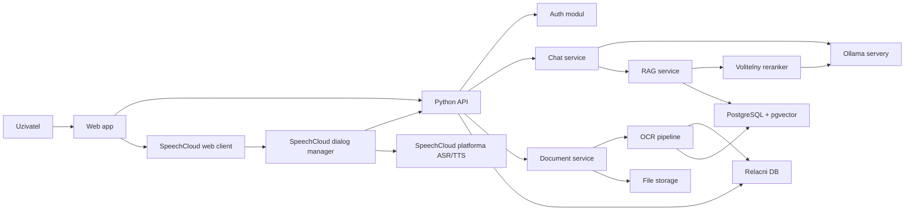

# Architektura

## Cilovy obraz

System je rozdeleny na webovy frontend, Python backend, dialogovy SpeechCloud manager, databazi, OCR/RAG pipeline a externi LLM runtime pres Ollama. Aplikacni casti projektu bezi pres Docker Compose v samostatnych kontejnerech, s vyjimkou externi SpeechCloud platformy a externich Ollama serveru.

## Aktualni stav

Aktivni casti systemu:

- Web app.
- Python API.
- SpeechCloud dialog manager.
- Auth modul.
- Chat service.
- Document service.
- OCR worker.
- RAG service s pgvector.
- Volitelny reranker.
- Ollama klienti pro chat, embedding, reranking, OCR a strukturovani.
- Relacni databaze pro uzivatele, dokumenty, historii chatu, voice sessions a embeddings.

Ukazkova implementace RAG ve slozce `example` se nepouziva jako zaklad. Projekt ma vlastni RAG vrstvu napojenou na dokumenty, uzivatele a pgvector.

## Backend moduly

- `auth`: registrace, prihlaseni, hash hesel, HTTP-only cookie session.
- `users`: sprava uzivatelske identity a uzivatelskych nastaveni.
- `chat`: konverzace, zpravy, agentni rozhodnuti, RAG a finalni odpoved.
- `llm`: adapter pro Ollama API, vyber modelu, timeouty, chyby.
- `voice`: kratkodobe voice sessions, tokeny a hlasove zpravy napojene na chat.
- `speechcloud`: dialog manager, ASR/TTS flow, WebSocket komunikace se SpeechCloud.
- `documents`: upload, metadata, soubory dokladu a stav zpracovani.
- `ocr`: extrakce textu z dokumentu.
- `rag`: skladani RAG textu, embeddings, vyhledavani relevantniho kontextu.
- `reranker`: volitelne preskupeni kandidatu z RAG podle dotazu.
- `inference`: routing roli mezi nakonfigurovanymi Ollama servery.

## Datovy model

Zakladni entity:

- `User`: id, email, password_hash, created_at, is_active.
- `Conversation`: id, user_id, title, created_at, updated_at.
- `Message`: id, conversation_id, role, content, model, retrieval metadata, created_at.
- `Document`: id, user_id, filename, mime_type, storage_path, status, created_at.
- `DocumentFile`: id, document_id, user_id, filename, mime_type, storage_path, sort_order, created_at.
- `OcrResult`: id, document_id, raw_text, normalized_text, metadata_json, language, page_count, engine, created_at.
- `DocumentExtraction`: id, document_id, structured_json, summary, review_status, model, raw_response, created_at.
- `UserSettings`: default_chat_model, tts_voice, ocr_processing_model, source strategy and reranker thresholds.
- `DocumentChunk`: id, document_id, text, embedding, metadata.
- `VoiceSession`: id, user_id, conversation_id, token_hash, status, speechcloud_session_id, expires_at.
- `InferenceRoutingSettings`: role assignment for chat, embedding, reranker, OCR and structuring across Ollama servers.

## Chat flow

1. Frontend odesle zpravu na backend.
2. Backend overi uzivatele.
3. Backend ulozi uzivatelskou zpravu.
4. Agent rozhodne, zda muze odpovedet primo, nebo musi hledat v dokladech.
5. Pokud je potreba hledat, backend pouzije strukturovane hledani, RAG a volitelny reranker.
6. Backend sestavi kontext konverzace a nalezenych zdroju.
7. Backend zavola vybrany chat model na prirazenem Ollama serveru.
8. Backend ulozi odpoved asistenta a vrati ji vcetne zdroju.

## Hlasovy flow

1. Frontend vytvori voice session pro prihlaseneho uzivatele.
2. SpeechCloud web klient se pripoji k dialog manageru pres WebSocket.
3. Frontend posle dialog manageru kratkodoby voice token.
4. Dialog manager attachne session na backend.
5. ASR vysledek se posle na backend jako bezna chatova zprava.
6. Backend provede stejny agent/RAG flow jako u textoveho chatu.
7. Odpoved se ulozi do konverzace, zobrazi ve frontendu a precte pres SpeechCloud TTS.

SpeechCloud ucet je pouze technicka ASR/TTS vrstva. Pristup k dokumentum vzdy urcuje prihlaseny uzivatel a voice token vydany backendem.

## RAG flow

1. Uzivatel nahraje dokument.
2. Backend ulozi jeden nebo vice souboru/fotek do slozky dokladu.
3. OCR pipeline vytahne text ze vsech souboru dokladu ve spravnem poradi.
4. LLM post-processing ve vychozim rezimu `vision_hybrid` posle do modelu OCR text i obrazky dokladu a vytvori strukturovana pole a lidsky popisek dokladu.
5. Uzivatel muze zkontrolovat a upravit strukturovana pole.
6. Backend indexuje deterministicky slozeny `rag_text`: popisek, klicova strukturovana pole, polozky, mnozstvi, jednotkove ceny, raw text polozek a uzivatelske poznamky.
7. Pri dotazu chat service vyzada relevantni dokumenty/chunky z RAG service.
8. Pokud je zapnuty reranker, kandidati se preskupuji podle dotazu.
9. Model dostane dotaz, historii a dokumentovy kontext vcetne odkazu na zdroj.
10. Odpoved obsahuje odkazy na detail dokladu.

## LLM zpracovani dokladu

OCR vystup neni finalni datovy produkt. Uklada se jako auditovatelny raw/normalizovany text. Nad nim bezi samostatny LLM krok pres Ollama. Vychozi rezim je hybridni: model dostane OCR text jako datovou kotvu a obrazek/fotky dokladu jako vizualni kotvu pro layout, tabulky a role poli.

Vystup obsahuje:

- strukturovana pole dokladu,
- kratky lidsky popisek vhodny pro embedding,
- confidence/nejistoty a odkazy na evidence v OCR textu,
- polozky vcetne mnozstvi, jednotek, cen a raw textu.

Model pro OCR post-processing je perzistentne nastavitelny v uzivatelskem nastaveni. Pokud neni vybran, pouzije se globalni `EXTRACTION_MODEL` a potom `OLLAMA_MODEL`. Role chat, embedding, reranker, OCR a structuring lze priradit k nakonfigurovanym Ollama serverum v nastaveni aplikace.

## Bezpecnostni zasady

- Data uzivatelu jsou oddelena pres `user_id` a autorizacni kontroly na backendu.
- Hesla se nikdy neukladaji v ciste podobe.
- Upload dokumentu kontroluje typ souboru, velikost a pristupova prava.
- LLM nesmi dostat dokumenty jineho uzivatele.
- Voice session token je kratkodoby a v databazi se uklada pouze jeho hash.
- Pro produkci je potreba HTTPS, secure cookies, CORS omezeny na frontend origin a reverzni proxy s podporou WebSocketu.
