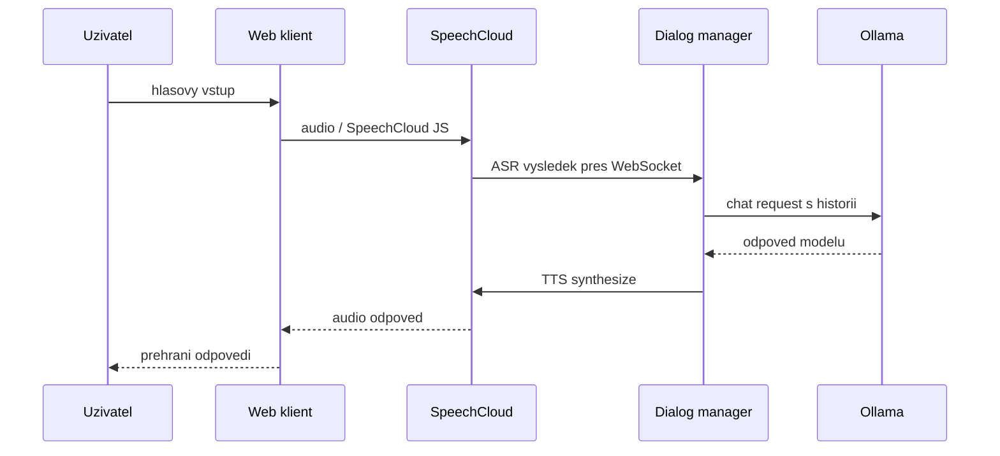

# SpeechCloud integrace

## Kontext

Soubor `docs/SpeechCloud.dialog.md` je dulezity referencni dokument pro hlasovou cast projektu. Slozka `example` obsahuje ukazkovy kod pro SpeechCloud dialog manager, SpeechCloud web klienta a napojeni na Ollama.

RAG priklad v `example/rag.py` se pro aktualni fazi neprebira jako implementacni zaklad. RAG jako vlastni projektova vrstva zustava v roadmapě a bude navrzena samostatne.

## Dulezite soubory

- `docs/SpeechCloud.dialog.md`: dokumentace SpeechCloud.dialog API.
- `example/dialog.py`: knihovni/ukazkova implementace `SpeechCloudWS` a `Dialog`.
- `example/example_base.py`: minimalni kostra dialog manageru.
- `example/example_cviceni.py`: ukazky ASR, SLU a TTS.
- `example/example_cviceni_chat.py`: nejdulezitejsi ukazka pro tento projekt, flow SpeechCloud ASR -> Ollama chat -> SpeechCloud TTS.
- `example/dialog_manager.py`: ukazka Ollama tool/function-call stylu pres Pydantic schema.
- `example/static/index.html`: SpeechCloud HTML klient, mikrofon, TTS, ASR eventy a obousmerne zpravy.

## Cilovy flow pro hlasovy chat

## Jak se pouzije ukazka

`example/example_cviceni_chat.py` ukazuje zakladni smycku:

1. Dialog manager spusti `SpeechCloudWS.run(...)`.
2. SpeechCloud klient se pripoji na WebSocket endpoint `/ws`.
3. Dialog manager oslovi uzivatele pres `synthesize_and_wait(...)`.
4. ASR vysledek se ziska pres `recognize_and_wait_for_asr_result(...)`.
5. Rozpoznany text se prida do `messages`.
6. Ollama `client.chat(...)` vrati odpoved.
7. Odpoved se precte pres SpeechCloud TTS.

Tento flow bude zaklad pro voice-chat MVP.

## Docker Compose dopad

Do compose stacku patri samostatna sluzba:

- `speech-dialog`: Python kontejner s dialog managerem.

Ollama se v zakladnim provozu nespousti jako povinny kontejner. `speech-dialog` se pripojuje na externi server pres `OLLAMA_BASE_URL`.

Minimalni konfigurace:

- `SPEECH_DIALOG_HOST=0.0.0.0`
- `SPEECH_DIALOG_PORT=8888`
- `SPEECH_STATIC_PATH=./static`
- `OLLAMA_BASE_URL=...`
- `OLLAMA_MODEL=...`
- `OLLAMA_USERNAME=...`
- `OLLAMA_PASSWORD=...`

Pokud SpeechCloud platforma potrebuje pristup na dialog manager zvenku, musi byt port nebo proxy dostupny podle konfigurace SpeechCloud aplikace.

## Bezpecnost

V ukazkovych souborech jsou hardcodovane pristupove udaje k Ollama serveru. V produkcnim kodu ani v repozitari nesmi zustat hesla natvrdo.

Pravidla:

- vsechny prihlasovaci udaje presunout do `.env`;
- `.env` nedavat do verzovaciho systemu;
- vytvorit pouze `.env.example` bez realnych hesel;
- logy nesmi vypisovat hesla ani authorization hlavicky;
- SpeechCloud session id lze logovat pro debugging, ale opatrne u citlivych dat.

## Otevrene body

- Finalni SpeechCloud application id.
- Verejna nebo proxy URL dialog manageru.
- Zda pouzit SpeechCloud proxy pro staticke HTML, nebo vlastni frontend.
- Jak mapovat SpeechCloud session na prihlaseneho uzivatele aplikace.
- Zda bude hlasovy chat ukladat stejnou historii jako textovy chat.

## Aktualni rozhodnuti

SpeechCloud je primarni hlasova vrstva projektu. Ze slozky `example` se pro hlasovy chat pouzije hlavne SpeechCloud/Ollama flow; `example/rag.py` je pouze nereferencni ukazka a vlastni RAG vrstva zustava samostatna budouci faze.
