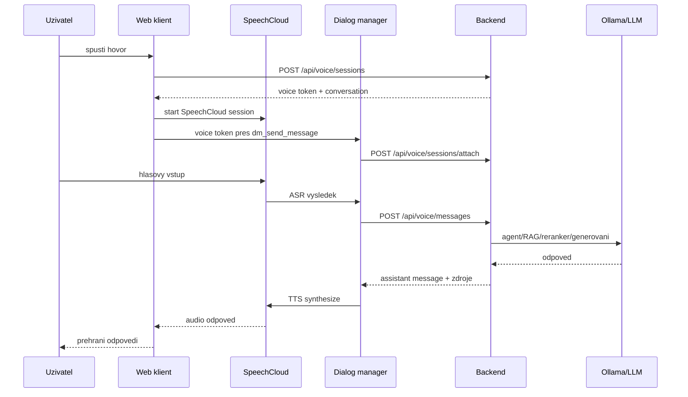

# SpeechCloud integrace

## Kontext

SpeechCloud je v projektu pouzit jako technicka vrstva pro rozpoznavani reci a syntetizaci hlasu. Neurcuje identitu uzivatele ani pristup k dokumentum. Tyto casti zustavaji v backendu aplikace.

Soubor `docs/SpeechCloud.dialog.md` je referencni dokument pro knihovnu SpeechCloud.dialog. Slozka `example` obsahuje ukazkovy kod pro SpeechCloud dialog manager a web klienta. Projekt z techto ukazek vychazi pro ASR/TTS flow, ale RAG a pristup k datum resi vlastni backendova vrstva.

## Dulezite soubory

- `docs/SpeechCloud.dialog.md`: dokumentace SpeechCloud.dialog API.
- `example/dialog.py`: knihovni/ukazkova implementace `SpeechCloudWS` a `Dialog`.
- `example/static/index.html`: SpeechCloud HTML klient, mikrofon, TTS, ASR eventy a obousmerne zpravy.
- `speech-dialog/app/main.py`: projektovy dialog manager napojeny na backend voice API.
- `backend/app/api/voice.py`: voice session API, attach endpoint a hlasove zpravy.
- `frontend/src/App.tsx`: SpeechCloud JS klient, hlasovy overlay a ovladani hovoru.

## Aktualni flow hlasoveho chatu



`speech-dialog` nevola Ollamu primo. Vzdy vola backend, aby hlasovy dotaz pouzil stejny agentni tok, stejne RAG zdroje, stejnou historii a stejne uzivatelske opravneni jako textovy chat.

## Voice session

Pri startu hovoru backend vytvori `VoiceSession`:

- session patri konkretnimu prihlasenemu uzivateli,
- je navazana na aktivni konverzaci nebo zalozi novou,
- frontend dostane kratkodoby bearer token,
- do databaze se uklada pouze hash tokenu,
- `speech-dialog` token pouziva pro `attach` a nasledne hlasove zpravy.

Tento mechanismus oddeluje technicky SpeechCloud ucet od identity uzivatele v aplikaci.

## Frontend a WebSocket

Lokalne muze frontend pouzit primou adresu dialog manageru:

```env
VITE_SPEECH_DIALOG_LOCAL_DM=ws://localhost:8888/ws
```

V produkci se pouziva relativni cesta:

```env
VITE_SPEECH_DIALOG_LOCAL_DM=/ws
```

Frontend nginx tuto cestu proxyuje do interniho `speech-dialog:8888/ws`. Reverse proxy pred frontendem proto musi mit zapnutou podporu WebSocketu pro frontend domenu.

## Hlasovy overlay

Hovor bezi v plovoucim overlayi nad chatem. Overlay zobrazuje stav hovoru, posledni rozpoznanou vetu, odpoved, zdroje a ovladani:

- ukonceni hovoru,
- stop TTS,
- ztlumeni mikrofonu.

Rozpoznane otazky i odpovedi se ukladaji do stejne historie konverzace jako textovy chat.

## Bezpecnost

- SpeechCloud prihlaseni je pouze technicky ucet pro ASR/TTS.
- Pristup k dokumentum se vzdy odviji od voice tokenu vydaneho backendem.
- `.env` a `.env.production` nesmi byt commitovane.
- Logy nesmi vypisovat hesla ani authorization hlavicky.
- SpeechCloud session id lze logovat pro debugging, ale opatrne u citlivych dat.

## Aktualni rozhodnuti

- SpeechCloud zustava primarni hlasova vrstva.
- RAG priklad z `example/rag.py` se nepouziva.
- Hlasovy chat pouziva stejnou backendovou chat/RAG sluzbu jako textovy chat.
- Produkcni WebSocket pro dialog manager prochazi pres `/ws` na frontend domene.
